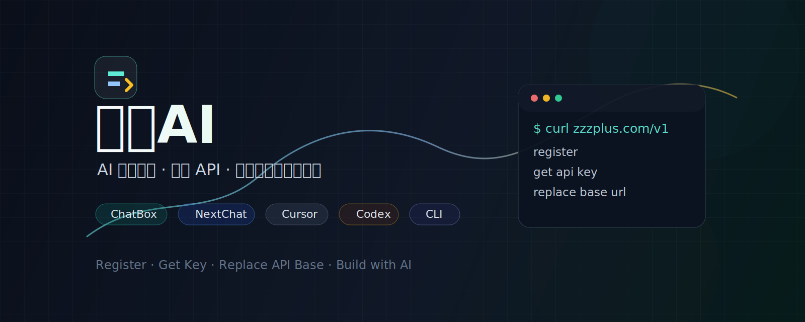

<p align="center">
  
</p>

<h3 align="center">面向 AI 学习者的实践基地 · 接入瞩目中转 API · 一站上手主流 AI 工具</h3>

<p align="center">
  <a href="./LICENSE"></a>
  <a href="./CONTRIBUTING.md"></a>
</p>

<p align="center">
  <a href="./docs/guide/02-subscribe-plus.md">快速开始</a>
  ·
  <a href="./docs/guide/00-overview.md">学习路线</a>
  ·
  <a href="./docs/platform/index.md">入口地图</a>
  ·
  <a href="./docs/configuration/index.md">配置专题</a>
  ·
  <a href="./docs/practice/index.md">实践方法</a>
  ·
  <a href="./docs/recipes/index.md">实战案例</a>
  ·
  <a href="./docs/reference/index.md">官方资料</a>
</p>

> 围绕瞩目中转 API，把 ChatBox、NextChat、Cursor、Codex、各类 OpenAI 兼容客户端串起来；同时整理 Codex 桌面 App、CLI、IDE、Cloud 与真实工程案例的使用方法。

## 你需要的两个地址

- 中转站主网址（注册账号 / 获取 API Key）：**https://zhumuai.com**
- 中转 API 接口地址（填到 ChatBox / NextChat / Cursor 等客户端）：**`https://zzzplus.com/v1`**

详细接入步骤请看 [快速开始：接入瞩目AI 中转 API](./docs/guide/02-subscribe-plus.md)。

## 这份教程适合谁

- **第一次接入 AI 工具的小白**：跟着快速开始把 ChatBox / NextChat / Cursor 接通。
- **想把 AI 用进项目的开发者**：学习 CLI、IDE、Git、测试、CI、AGENTS.md、沙盒与审批。
- **内容创作者与知识工作者**：把 AI 用在写作、PPT、资料整理、知识库、浏览器和工作流自动化里。
- **团队负责人和工具建设者**：建立团队规则、任务模板、权限边界、复盘结构和可迁移案例库。

## 你会在这里看到什么

| 内容 | 说明 |
| --- | --- |
| 快速开始 | 注册中转账号、获取 API Key、替换 API Base，一次性接通主流 AI 客户端 |
| 入门路线 | 从安装、登录、设置、手机协同到第一个低风险任务 |
| 入口地图 | 解释桌面 App、CLI、Cloud、IDE 和集成生态该怎么选 |
| 配置专题 | 覆盖 CLI 选项、`config.toml`、MCP、Skills、Subagents、安全审批 |
| 工作流方法 | 任务设计、验证方式、非开发工作流、团队 playbook |
| 实战案例 | PPT、Draw.io、浏览器、Obsidian、飞书、Figma、Notion、CI 修复等场景 |
| 官方资料索引 | 汇总 OpenAI 官方资料、GitHub 仓库和关键事实来源 |

## 推荐阅读路径

### 1. 第一次上手

先按 [快速开始：接入瞩目AI 中转 API](./docs/guide/02-subscribe-plus.md) 把账号和接口配好，再阅读 [学习路线](./docs/guide/00-overview.md) 选一个方向继续。

### 2. 想用 AI 改真实项目

从 [CLI 安装与登录](./docs/guide/11-cli-installation.md) 开始，接着看 [第一次让 Codex 改代码](./docs/guide/12-cli-first-run.md)、[AGENTS.md](./docs/guide/14-agents-md.md)、[沙盒与审批](./docs/guide/15-sandbox-approvals.md)。

### 3. 想把 AI 放进团队

先看 [团队 playbook](./docs/practice/team-playbook.md)，再补齐 [配置与扩展](./docs/configuration/index.md)、[安全管理](./docs/configuration/security-admin.md)、[排障手册](./docs/guide/17-troubleshooting.md) 和 [实战案例库](./docs/recipes/index.md)。

## 内容框架

```text
瞩目AI 教学基地
├─ guide         # 快速开始、入门到团队化的实践指南
├─ platform      # CLI、App、Cloud、IDE、ChatGPT 入口地图
├─ configuration # CLI 选项、config.toml、MCP、Skills、安全审批
├─ practice      # 任务设计、非开发工作流、团队实践
├─ recipes       # 可复用的真实工程案例
├─ reference     # 官方资料索引与事实来源
└─ community     # 共建路线图与贡献方向
```

## 本地预览

环境要求：

- Node.js 22+
- pnpm

```bash
pnpm install
pnpm dev
```

构建静态站点：

```bash
pnpm build
```

默认开发服务会启动 VuePress 文档站，构建产物输出到 `docs/.vuepress/dist`，可以直接部署到 Vercel、Zeabur 等静态站点平台。

## 设计原则

- **官方优先**：功能、价格、可用性、安全策略以 OpenAI 官方资料为准。
- **小白友好**：每个入门章节尽量说明"为什么这样做"和"什么时候不要这样做"。
- **真实任务导向**：减少抽象概念堆砌，多给可复制的任务流程、输入、输出和验证方式。
- **安全边界清晰**：涉及文件写入、命令执行、联网、凭据、浏览器和电脑操控时明确风险。
- **可沉淀**：鼓励把一次成功任务整理成 AGENTS.md、模板、案例、复盘和团队规范。

## 参与贡献

欢迎提交：

- 新手友好的教程改写。
- 可复现的真实案例。
- 常见错误和解决方案。
- 团队实践、模板和工作流。
- 官方文档变更同步。

请先阅读 [贡献指南](./CONTRIBUTING.md)。

## 开源协议

本项目采用 [MIT License](./LICENSE) 开源。你可以在保留许可声明的前提下自由使用、修改、分发与二次开发。

## 声明

本项目是社区维护的 AI 实践教学基地，并非 OpenAI 官方项目。涉及功能、计划、价格、可用性和安全策略等时间敏感信息时，请以 OpenAI 官方资料为准。
